# Voxwave

#### Overview

Voxwave is an innovative real-time audio communication application that allows users to join and interact in public audio rooms and stream FM radios from around the world. It provides a seamless, engaging user experience with real-time updates, user authentication via Google OAuth and JWT, and a responsive design suitable for both mobile and desktop devices.

## Features

- **Real-time Audio Communication:** Join public audio rooms and experience HD audio quality for seamless conversations.
- **Public Streaming FM Radios:** Access a wide range of FM radio stations globally using the Radio API.
- **User Authentication:** Secure user login and registration through Google OAuth and JWT.
- **Responsive Design:** Optimized for mobile and desktop views.
- **File Uploads:** Share images and files within audio rooms using Firebase Bucket Storage.
- **Unlimited Connections:** Supports unlimited number of users in audio rooms for large-scale interactions.

## Problem Solved

With the removal of the 3.5 mm audio jack from modern mobile devices, users face challenges in listening to FM radios directly on their phones. Voxwave solves this issue by providing a platform to stream FM radios through the internet, eliminating the need for a physical radio jack. This ensures users can enjoy their favorite radio stations without the hardware limitations of their devices.

## Screenshots

Here are some screenshots of the application:

### Landing Page
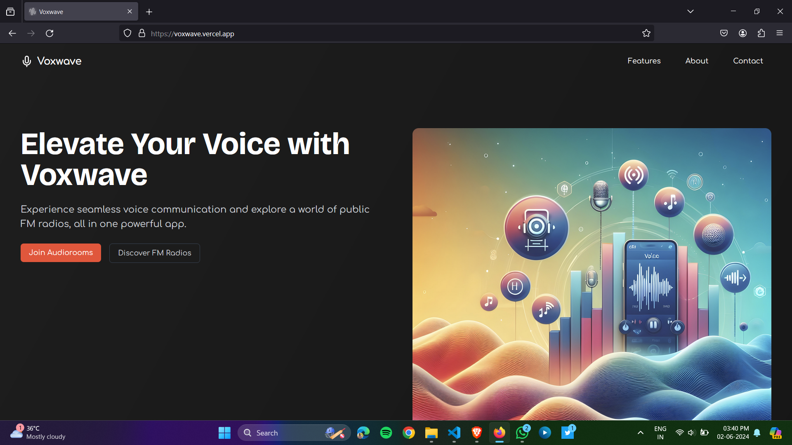

---
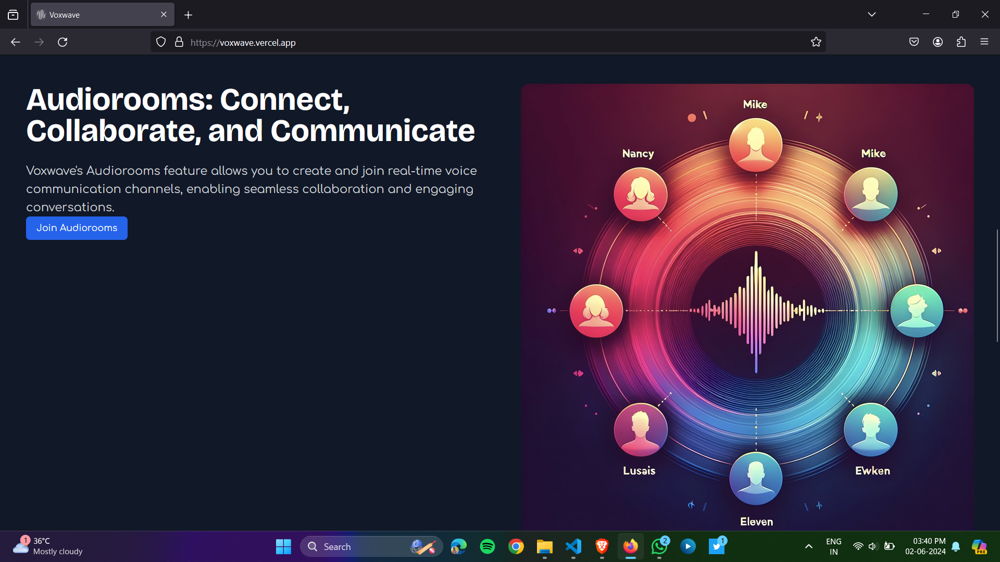

---

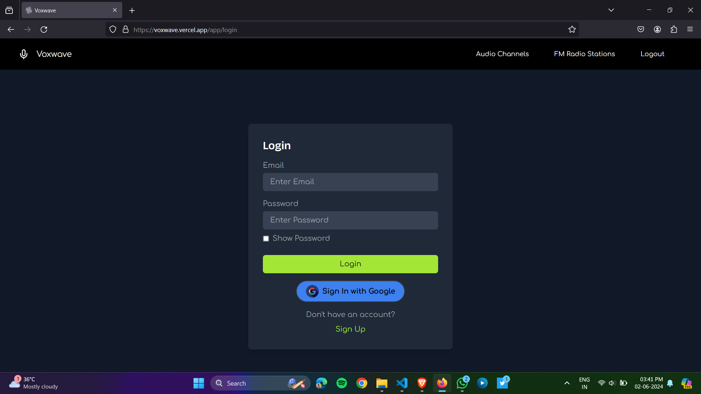

---

### Audio Rooms
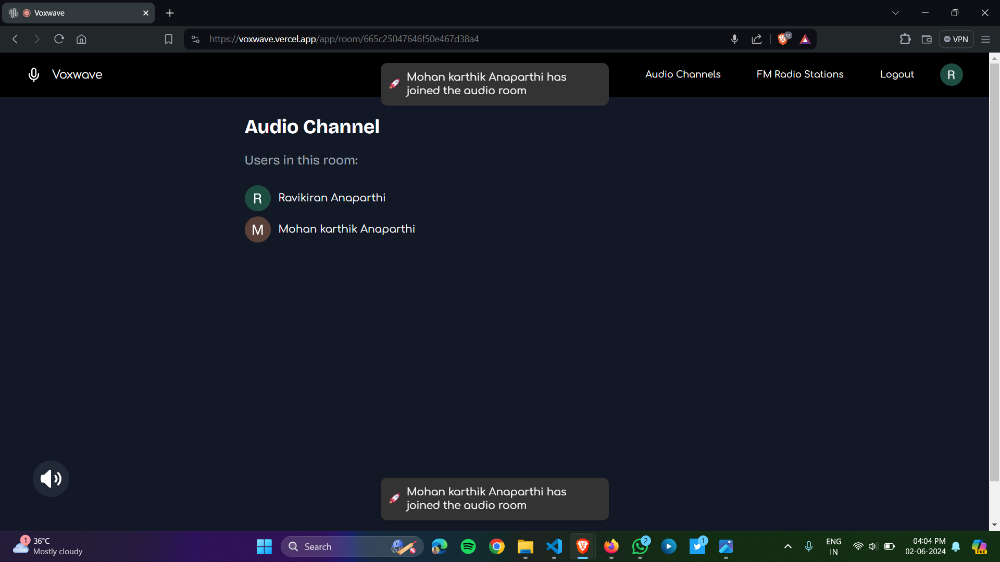

---

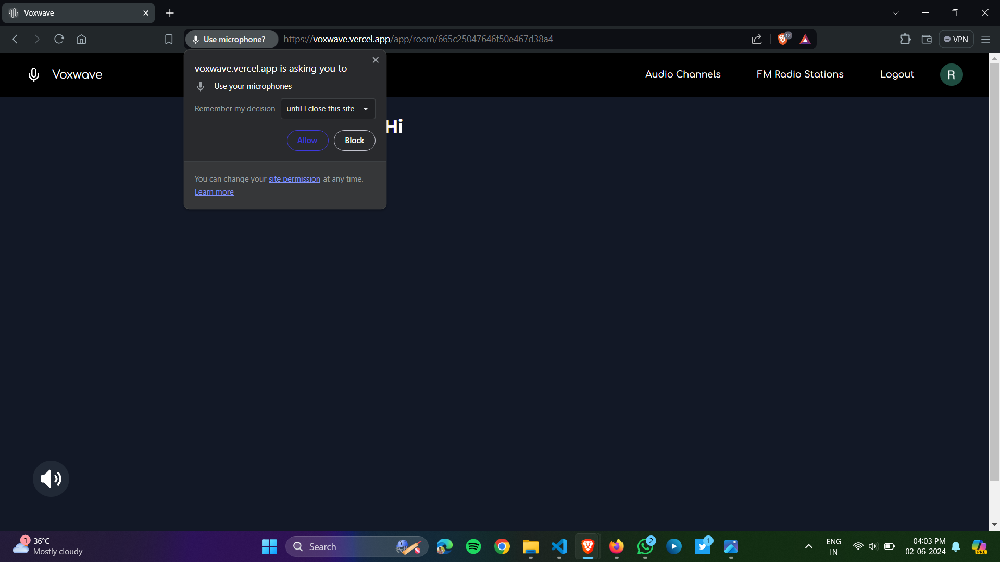

---

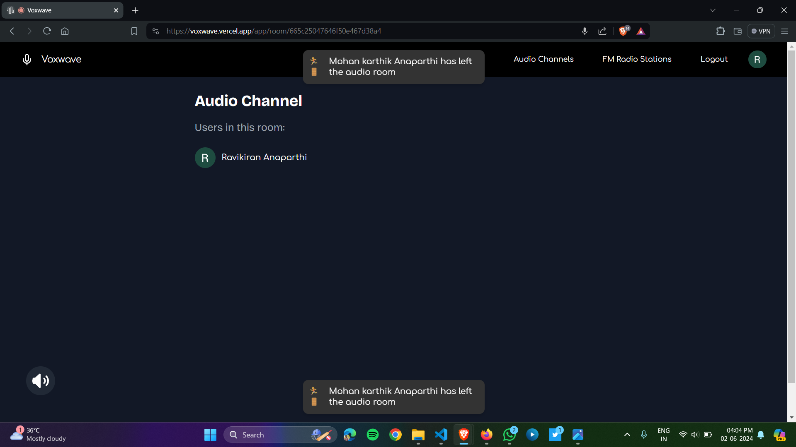

---
![Audio Rooms]
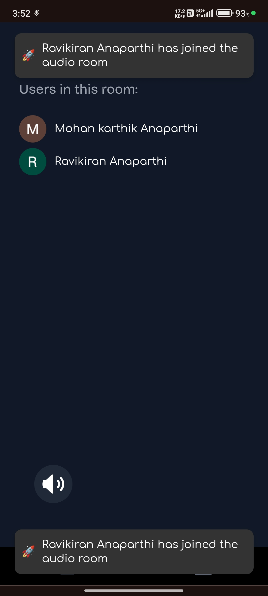
---
### FM Radios 
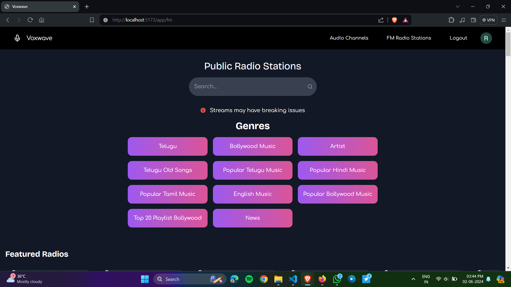
---

![FM Radios]
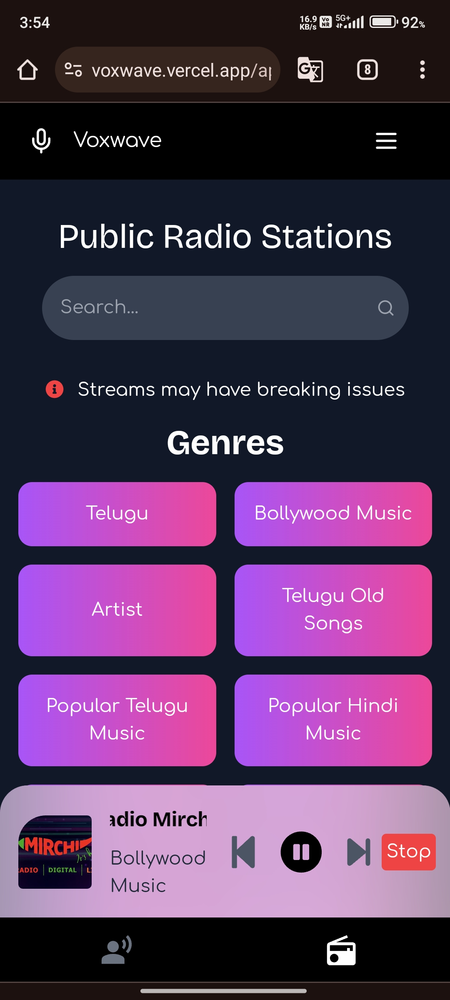
---
![FM Radios]
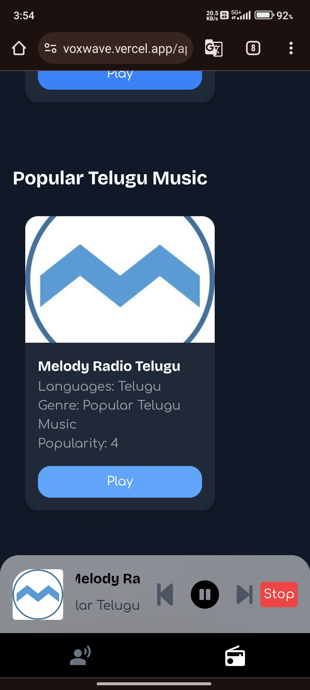
---

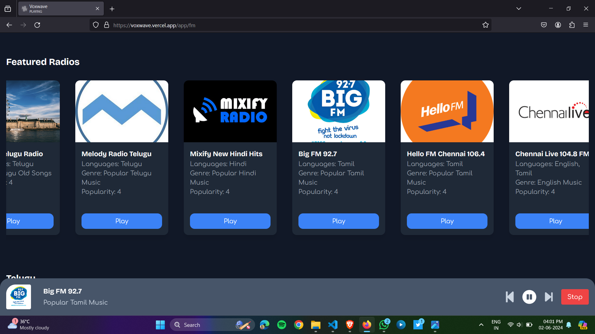

---
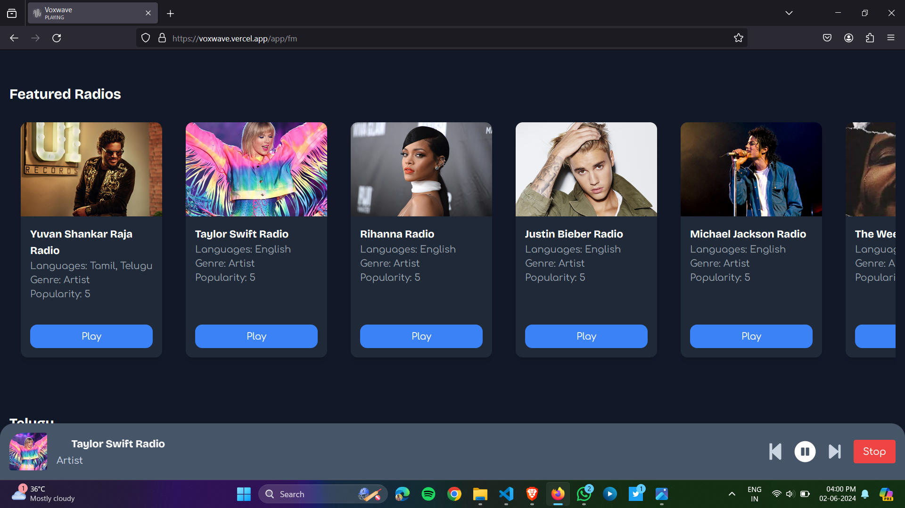

---
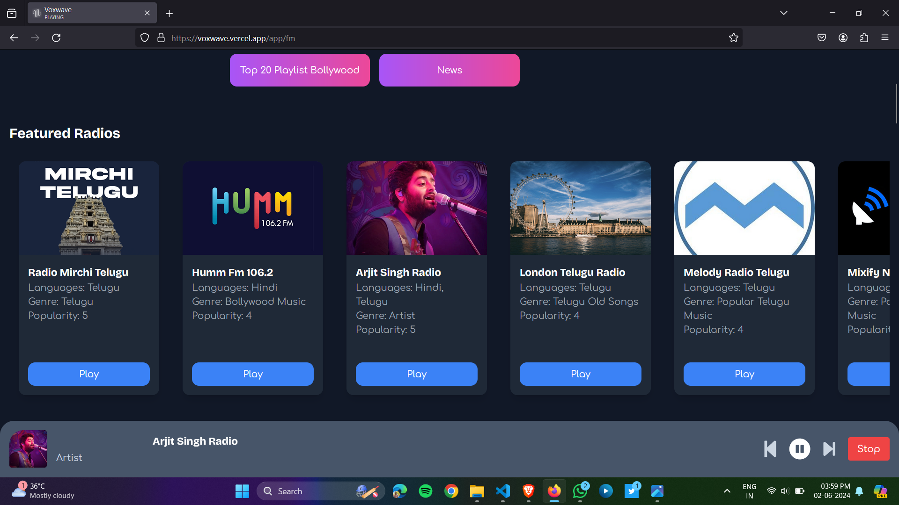

---
## Technologies Used

- **Frontend:** React, Vite, Tailwind CSS, Socket.IO Client
- **Backend:** Node.js, Express, MongoDB, Socket.IO
- **Audio Communication:** AgoraRTC
- **Streaming FM Radios:** Radio API
- **Authentication:** Google OAuth, JWT (JSON Web Token)
- **Hosting:** Vercel, Render
- **Security:** DOMPurify, Validator for input sanitization and validation to prevent XSS and other injection attacks.

## Demo Credentials

For quick access and testing, you can use the following guest login credentials:

- Email: ram@gmail.com
- Password: ram

## Setup Instructions

### Prerequisites

- Node.js (>=14.x)
- npm

### Cloning Repository

```sh
git clone https://github.com/ravikirananaparthi/Voxwave.git
```

## Environment Variables

To run the application locally, you need to set up environment variables for both the frontend and backend.

#### Frontend Environment Variables

Create a `.env` file in the `client` directory with the following content:

```env
VITE_FIREBASE_API_KEY=your_firebase_api_key
VITE_FIREBASE_AUTH_DOMAIN=your_firebase_auth_domain
VITE_FIREBASE_PROJECT_ID=your_firebase_project_id
VITE_FIREBASE_STORAGE_BUCKET=your_firebase_storage_bucket
VITE_FIREBASE_MESSAGING_SENDER_ID=your_firebase_messaging_sender_id
VITE_FIREBASE_APP_ID=your_firebase_app_id
VITE_SERVER_VARIABLE=http://localhost:4000/api/v1
VITE_SOCKET_SERVER=http://localhost:4000
```

#### Backend Environment Variables

Create a `.env` file in the `server` directory with the following content:

```env
PORT=4000
MONGO_URI=your_mongo_db_connection_string
JWT_SECRET=your_jwt_secret
GOOGLE_CLIENT_ID=your_google_client_id
GOOGLE_CLIENT_SECRET=your_google_client_secret
AGORA_APP_ID=your_agora_app_id
RADIO_API_KEY=your_radio_api_key
```

### Running the Application Locally

#### Frontend

1. Navigate to the client directory:
    ```sh
    cd client
    ```

2. Install dependencies:
    ```sh
    npm install
    ```

3. Run the frontend development server:
    ```sh
    npm run dev
    ```

#### Backend

1. Navigate to the server directory:
    ```sh
    cd ../server
    ```

2. Install dependencies:
    ```sh
    npm install
    ```

3. Run the backend development server:
    ```sh
    npm run dev
    ```

### Access the Application

Open your browser and navigate to `http://localhost:5173`.

## Radio API Usage

To get streaming URLs for public FM radios, you can use the Radio API with the following endpoints. You need to provide the `searchterm` and choose the desired `format` (either `json` or `xml`).

### Available Endpoints

- **By UUID:** `http://de1.api.radio-browser.info/{format}/stations/byuuid/{searchterm}`
- **By Name:** `http://de1.api.radio-browser.info/{format}/stations/byname/{searchterm}`
- **By Exact Name:** `http://de1.api.radio-browser.info/{format}/stations/bynameexact/{searchterm}`
- **By Codec:** `http://de1.api.radio-browser.info/{format}/stations/bycodec/{searchterm}`
- **By Exact Codec:** `http://de1.api.radio-browser.info/{format}/stations/bycodecexact/{searchterm}`
- **By Country:** `http://de1.api.radio-browser.info/{format}/stations/bycountry/{searchterm}`
- **By Exact Country:** `http://de1.api.radio-browser.info/{format}/stations/bycountryexact/{searchterm}`
- **By Country Code:** `http://de1.api.radio-browser.info/{format}/stations/bycountrycodeexact/{searchterm}`
- **By State:** `http://de1.api.radio-browser.info/{format}/stations/bystate/{searchterm}`
- **By Exact State:** `http://de1.api.radio-browser.info/{format}/stations/bystateexact/{searchterm}`
- **By Language:** `http://de1.api.radio-browser.info/{format}/stations/bylanguage/{searchterm}`
- **By Exact Language:** `http://de1.api.radio-browser.info/{format}/stations/bylanguageexact/{searchterm}`
- **By Tag:** `http://de1.api.radio-browser.info/{format}/stations/bytag/{searchterm}`
- **By Exact Tag:** `http://de1.api.radio-browser.info/{format}/stations/bytagexact/{searchterm}`

### Example Usage

Here's how to use the Radio API to fetch radio stations by country in JSON format:

1. **API Endpoint:** `http://de1.api.radio-browser.info/json/stations/bycountry/{searchterm}`
2. **Request Example:**
    ```javascript
    import axios from 'axios';

    const fetchRadioStations = async (country) => {
      try {
        const response = await axios.get(`http://de1.api.radio-browser.info/json/stations/bycountry/${country}`);
        console.log(response.data);
      } catch (error) {
        console.error('Error fetching radio stations:', error);
      }
    };

    fetchRadioStations('USA');
    ```

3. **Response Example:**
    ```json
    [
      {
        "name": "Station 1",
        "stream_url": "http://stream.radio.com/station1",
        ...
      },
      {
        "name": "Station 2",
        "stream_url": "http://stream.radio.com/station2",
        ...
      }
    ]
    ```

By using Voxwave, users can overcome the limitations of modern mobile devices lacking a 3.5 mm audio jack, and enjoy high-quality audio communication and global FM radio streaming effortlessly.